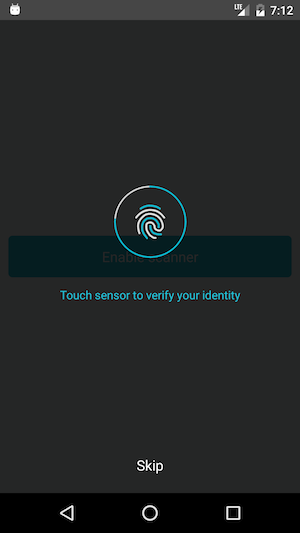

# react-native-touch-id-android


[](https://npmjs.org/package/react-native-touch-id-android "View this project on npm")
[](https://npmjs.org/package/react-native-touch-id-android "View this project on npm")
[](https://github.com/ElekenAgency/react-native-touch-id-android/blob/master/LICENSE.md)
[](https://travis-ci.org/ElekenAgency/react-native-touch-id-android)

Fingerprint identity for Android based on https://github.com/ajalt/reprint


## Demo





## Installation Android

**Tested only on RN version > 0.40**

1. `npm install react-native-touch-id-android --save`
2. `react-native link react-native-touch-id-android`

3. `android/build.gradle` (**not** android/app/build.gradle, pay attention):

```js


allprojects {
    repositories {
        mavenLocal()
        jcenter()
        maven {
            // All of React Native (JS, Obj-C sources, Android binaries) is installed from npm
            url "$rootDir/../node_modules/react-native/android"
        }
        maven { url "https://jitpack.io" }            // <--- add this line
    }
}

```

4. `android/app/src/main/java/<YOUR-APP-FOLDER>/MainApplication` file, check if you already have this lines:


```js

import com.github.ajalt.reprint.core.Reprint;      // <- add this line
import co.eleken.react_native_touch_id_android.FingerprintPackage;    // <- add this line

public class MainApplication extends Application implements ReactApplication {

...

  private final ReactNativeHost mReactNativeHost = new ReactNativeHost(this) {

    @Override
    protected List<ReactPackage> getPackages() {
      return Arrays.<ReactPackage>asList(
          new MainReactPackage(),
          new FingerprintPackage(),     // <- add this line
      );
    }
    
  };

  @Override
  public void onCreate() {
    super.onCreate();
    Reprint.initialize(this); // <- add this line
  }

...

```

5. Enable fingerprint in phone's settings


# Usage

1. `Finger.isSensorAvailable()`: Promise returns `true` if success and string `error` in other cases (including case when you have sensor, but not enabled it in your phone's settings)

  ```js

  Finger.isSensorAvailable()
      .then((isAvailable) => {   })
      .catch(error => {   });

  ```    

2. `Finger.requestTouch()`: Promise returns `true` if success and string `error` in other cases.


  ```js

  Finger.requestTouch()
      .then(success => {  })
      .catch(error => {  });

  ```

3. `Finger.dismiss()` if you open sensor and want to close it before touching (like when close app or dialog)

# Example

```js

import Finger from 'react-native-touch-id-android'

export default class TouchTest extends Component {

  componentDidMount() {
    Finger.isSensorAvailable()
      .then((isAvailable) => {
        ToastAndroid.show('Sensor is available and is waiting for touch', ToastAndroid.SHORT);
        this.touchAuth()
      })
      .catch(error => {
        ToastAndroid.show(error, ToastAndroid.SHORT);
      });
  }

  touchAuth(){
    Finger.requestTouch()
      .then(success => {
        ToastAndroid.show('Access granted', ToastAndroid.SHORT);
      })
      .catch(error => {
        ToastAndroid.show(error, ToastAndroid.SHORT);
      });
  }

  render() {
    return (    

        ...

    );
  }

  componentWillUnmount(){
    Finger.dismiss()
  }
}


```

# Troubleshooting

If you made **5 wrong fingerprint attempts**, Android Fingerprint API requires some time to continue work with sensor. In that case `Finger.requestTouch()` returns error `LOCKED_OUT`, so it would be good to make user awared that senser is temporary unavailable (near 30 seconds).


## Questions or suggestions?

Feel free to [open an issue](https://github.com/ElekenAgency/react-native-touch-id-android/issues)
